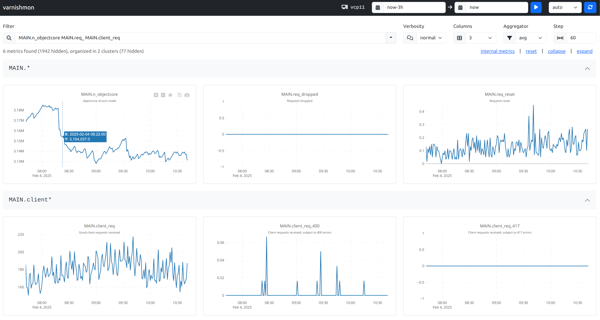

# varnishmon

[](../../actions/workflows/main.yml)
[](../../actions/workflows/codeql.yml)
[](../../releases)
[](https://goreportcard.com/report/github.com/allenta/varnishmon)
[](https://pkg.go.dev/github.com/allenta/varnishmon)

`varnishmon` is a utility inspired by the [classic `atop` tool](https://www.atoptool.nl). It periodically collects metrics from [Varnish Cache](https://varnish-cache.org) / [Varnish Enterprise](https://www.varnish-software.com/products/varnish-enterprise/) using the [`varnishstat` utility](https://varnish-cache.org/docs/trunk/reference/varnishstat.html), stores them in a [DuckDB](https://duckdb.org) database, and provides a simple built-in web interface for visualizing the timeseries data. **In summary, `varnishmon` is a tool designed to effortlessly record, visualize, and share historical `varnishstat` output with minimal setup.**



While `varnishmon` **doesn't replace a comprehensive monitoring solutions like Prometheus or Zabbix**, it is particularly useful when existing monitoring systems fall short. The most common use case is troubleshooting, where **more granular samples** (usual monitoring periods may be insufficient) and/or **additional metrics** (scraping the entire `varnishstat` output is typically excessive for daily monitoring) are needed. The collected data is stored in a DuckDB database, making it easy to share and analyze with other tools.

`varnishmon` is a self-contained executable that allows you to start collecting data with minimal effort and explore it through a simple yet effective web interface. In addition to occasional troubleshooting, `varnishmon` can also be used as a lightweight, permanent service to collect, store, visualize, and rotate Varnish metrics. Similar to running `atop` in logging mode as a complement to regular monitoring, `varnishmon` provides valuable context during incident analysis.

## 🚀 Quick Start

1. **Download & install**
   - Download the latest release from the [releases page](../../releases). Choose between a `.tgz` file containing only the `varnishmon` executable, or a DEB / RPM package if you plan to run `varnishmon` as a service.
   - The executable is self-contained and does not require any additional dependencies.

1. **Collect metrics**
   - Run the following command to scrape metrics every 15 seconds, store them in `/tmp/varnishmon.db` (to use an in-memory database, omit the `--db` option), and bind the built-in web interface to port 6100 on all interfaces. Behind the scenes this will run `/usr/bin/varnishstat -1 -j` periodically, so ensure your user has the necessary permissions (typically, you need to be in the `varnish` group):
     ```bash
     varnishmon --period 15s --db /tmp/varnishmon.db --ip 0.0.0.0 --port 6100
     ```
   - If running `varnishmon` as a service:
     - Fine-tune the configuration by editing [the `/etc/varnishmon/varnishmon.yml` file](extras/packaging/varnishmon.yml) and start the service with `systemctl start varnishmon`.
     - By default, the timeseries data will be stored in `/var/lib/varnishmon/varnishmon.db` and the logs in `/var/log/varnishmon/varnishmon.log`.

2. **Visualize timeseries**
   - Open your browser and navigate to `http://<host>:6100`.
   - Remember to stop `varnishmon` when you're done, as it will continue to collect metrics until you kill the process.

## 🤔 Q & A

### Usage

- **How do I access the `varnishmon` web interface?**
  > First, ensure the `varnishmon` API is enabled (it is by default) and successfully bound to an IP address and port (default is `127.0.0.1:6100`). To make it accessible from other hosts, you can bind it to `0.0.0.0`; however, using an SSH tunnel is typically the best option. Then, open your browser and navigate to `http://localhost:6100`.
  > ```bash
  > ssh -L 6100:localhost:6100 user@host
  > ```

- **I need `sudo` to run `varnishstat`. How can I use `varnishmon`?**
  > Ideally, you should add your user to the `varnish` group to avoid using `sudo`. If this is not possible, you can use the `--varnishstat` flag (or the `scraper.varnishstat` setting) to specify the command `varnishmon` should use to collect metrics. Ensure you use the `-1 -j` flags to output JSON. Note that the full path of the `sudo` command is required because `varnishmon` does not use a shell.
  > ```bash
  > varnishmon \
  >   --period 15s \
  >   --db /tmp/varnishmon.db \
  >   --varnishstat '/usr/bin/sudo varnishstat -1 -j'
  > ```

- **Can I use `varnishmon` with Varnish instances running in a container?**
  > If you can run `varnishmon` directly within the container, no special configuration is required. However, if you need to execute a command like `docker exec ...` to gather the `varnishstat` output, you can use the `--varnishstat` flag (or the `scraper.varnishstat` setting) to specify an alternative command.  Remember to use the `-1 -j` flags (to ensure `varnishstat` outputs JSON) and to provide the full path to the `docker` command.

- **How do I use `varnishmon` to collect metrics remotely?**
  > You can use the `--varnishstat` flag (or the `scraper.varnishstat` setting) to specify a command that collects metrics remotely. For example, you can use `/usr/bin/ssh <user>@<host> varnishstat -1 -j`. Make sure to use SSH keys for passwordless authentication and don't forget to provide the full path to the `ssh` command.

- **How do I use `varnishmon` to visualize metrics previously collected on a different server?**
  > Similar to `atop`, you can collect metrics on the Varnish server, transfer them to your local machine, and use `varnishmon` to visualize them. In this case, you may want to:
  >   - Use the `--no-api` flag (or the `api.enabled` setting) on the Varnish server to prevent the web interface from starting there.
  >   - Use the `--no-scraper` flag (or the `scraper.enabled` setting) on your local machine to avoid collecting metrics locally.

- **How often does `varnishmon` collect metrics?**
  > That depends on the `--period` flag (or the `scraper.period` setting). The default value is set to 60 seconds, but you can adjust it to suit your needs.

### Configuration & Customization

- **What are the system requirements for `varnishmon`?**
  > `varnishmon` is a lightweight utility. Its embedded DuckDB database is by far the most resource-intensive component, but the default configuration (i.e., `db.memory-limit`, `db.threads`, etc.) [limits resource consumption](https://duckdb.org/docs/configuration/overview.html) to 512 MiB and 1 CPU core. However, depending on the number of metrics in your Varnish setup and the scraping period, it may require a significant amount of disk space and memory. Plan accordingly and adjust the limits as needed.

- **I'm tired of typing the same options every time I run `varnishmon`. Can I save them?**
  > Command line flags are shortcuts to override settings in the configuration file. Alternatively, you can create a [configuration file](extras/packaging/varnishmon.yml) in one of the standard locations (`/etc/varnish/varnishmon.yml`, `~/.config/varnishmon.yml`, etc.) and let `varnishmon` read it automatically. This is the default behavior when running `varnishmon` as a service.

- **Is it possible to secure the `varnishmon` web interface?**
  > For typical operation (i.e., API bound to `127.0.0.1` and accessed through an SSH tunnel), this is likely not a concern. However, the [configuration file](extras/packaging/varnishmon.yml) allows you, (1) to specify a username and password for HTTP Basic Authentication; and (2) to enable HTTPS.

- **What if I don't want to run the `varnishmon` web interface?**
  > Use the `--no-api` flag (or the `api.enabled` setting) to prevent the web interface from starting. You can still collect metrics and store them in the database.

- **Can I customize the metrics collected by `varnishmon`?**
  > Not directly, as `varnishmon` is designed to collect comprehensive information. However, you can use the `--varnishstat` flag (or the `scraper.varnishstat` setting) to specify a wrapper script that filters the `varnishstat` output (or an inline command if you're up for the quoting challenge). Check out [this example wrapper script](files/varnishstat.py) for inspiration on how to filter and/or extend the metrics collected.
    > ```bash
    > varnishmon \
    >   --period 15s \
    >   --db /tmp/varnishmon.db \
    >   --varnishstat "/usr/bin/bash -c 'varnishstat -1 -j | jq \"with_entries(select(.key | test(\\\"^VBE|MEMPOOL[.]\\\") | not))\"'"
    > ```

- **What if I don't want to store the collected data permanently?**
  > To use an in-memory database, set the `--db` flag (or the `db.file` setting) to an empty value. Note that the data will be lost when `varnishmon` exits. Additionally, be aware that an in-memory database may consume a significant amount of memory, depending on (1) the number of metrics; (2) the scraping period; and (3) the duration `varnishmon` runs.

- **How do I build `varnishmon` from source?**
  > The build process is designed to be executed on the target platform (e.g., Ubuntu Noble, Ubuntu Jammy, etc.) and architecture (`amd64` or `arm64`). The dependencies are minimal (`make`, `git`, `go`, `g++`, etc.; refer to the [Dockerfiles used by GitHub Actions](extras/github/docker) for guidance). To build, simply run `make build` in the root of the repository.

### Running as a Service

- **Can I run `varnishmon` as a service?**
  > Yes, `varnishmon` is designed to be run as a service. You can use the DEB / RPM packages available in the [releases page](../../releases) or create your own service unit file.

- **I'm running `varnishmon` as a service. How do I rotate the database?**
  > The DEB / RPM packages include `logrotate` configuration files to manage the rotation of the database and log files. Alternatively, you can manually rotate them by renaming the database and log files, and then sending a `SIGHUP` signal to the `varnishmon` process. This method also works with an in-memory database, discarding the old data.
  > ```bash
  > kill -HUP $(pgrep varnishmon)
  > ```

- **Is it necessary to rotate the `varnishmon` database?**
  > While it is not mandatory, `varnishmon` is optimized for navigating databases that cover relatively short time periods. For visualizing metrics over extended periods, it is recommended to use a dedicated monitoring tool like Prometheus or Zabbix.

- **I'm running `varnishmon` as a service. How can I monitor its health?**
  > Whether running as a service or as a standalone tool, `varnishmon` exposes a `/metrics` API endpoint for health monitoring. You can use a monitoring tool like Prometheus to scrape this endpoint and set up alerts based on the collected metrics.
  > ```
  > $ curl -s http://localhost:6100/metrics
  >...
  ># HELP archiver_out_of_order_samples_total Out-of-order samples received by the archiver worker
  ># TYPE archiver_out_of_order_samples_total counter
  >archiver_out_of_order_samples_total 0
  ># HELP archiver_push_completed_total Successful pushes of metrics by the archiver worker
  ># TYPE archiver_push_completed_total counter
  >archiver_push_completed_total 47248
  ># HELP archiver_push_failed_total Failed pushes of metrics by the archiver worker
  ># TYPE archiver_push_failed_total counter
  >archiver_push_failed_total 0
  ># HELP archiver_reset_counters_total Counter resets detected by the archiver worker
  ># TYPE archiver_reset_counters_total counter
  >archiver_reset_counters_total 0
  ># HELP archiver_truncated_samples_total Samples (bitmaps excluded) truncated by the archiver worker
  ># TYPE archiver_truncated_samples_total counter
  >archiver_truncated_samples_total 0
  >...

### Miscellaneous

- **Why `varnishstat`? Why not use the Varnish shared memory log?**
  > While it may seem beneficial to avoid forking the `varnishstat` process on every scrape, we believe it wouldn't significantly impact performance. Moreover, it would reduce the flexibility provided by the use of a wrapper script, such as filtering metrics or running on a different host.

- **How is the collected data stored?**
  > The collected data is stored as timeseries in a DuckDB database using a straightforward schema. The output of `varnishstat` is stored mostly as-is, except for counters, which are converted into eps rates to enhance data usability. [Download the DuckDB CLI](https://duckdb.org/docs/installation/) to explore the database on your own. It's very simple.
  > ```
  > $ duckdb /path/to/varnishmon.db
  > v1.1.3 19864453f7
  > Enter ".help" for usage hints.
  > D show tables;
  > ┌───────────────┐
  > │     name      │
  > │    varchar    │
  > ├───────────────┤
  > │ metadata      │
  > │ metric_values │
  > │ metrics       │
  > └───────────────┘
  >
  > D select * from metric_values;
  > ┌───────────┬─────────────────────┬───────────────────────────────────────┐
  > │ metric_id │      timestamp      │                 value                 │
  > │   int32   │      timestamp      │ union(float64 double, uint64 ubigint) │
  > ├───────────┼─────────────────────┼───────────────────────────────────────┤
  > │         1 │ 2025-01-22 18:13:53 │ 1                                     │
  > │         2 │ 2025-01-22 18:13:53 │ 768                                   │
  > │         3 │ 2025-01-22 18:13:53 │ 1467764736                            │
  > │         4 │ 2025-01-22 18:13:53 │ 1020225                               │
  > │         5 │ 2025-01-22 18:13:53 │ 0                                     │
  > │         6 │ 2025-01-22 18:13:53 │ 0                                     │
  > ```

- **Are `varnishstat` `uint64` values fully supported?**
  > Counters are stored in the DuckDB database as `float64` eps rates for convenience. Other `uint64` values (e.g., gauges, bitmaps, etc.) are stored with the most significant bit dropped due to a limitation in Go's SQL package. Additionally, on the client side (JavaScript), we are constrained by the Number type, which is a `float64` value. In summary, `varnishstat` `uint64` values are supported, but with these minor limitations.

- **Why DuckDB?**
  > DuckDB is an ideal choice for `varnishmon` because it is a lightweight, timeseries-friendly, and easily embeddable in-process analytical database. Its CLI is a simple, statically-linked binary that provides an easy way to analyze and share collected data with other tools.

- **I want to contribute to `varnishmon`. How can I help?**
  > This is a small project, but there are many areas where you can contribute. Feel free to open an issue or a PR, or simply share your thoughts and ideas. A good starting point is to check [the cheat sheet in the `docker-compose.yml` file](docker-compose.yml) and start using the development environment.

## 📝 License

Please refer to [LICENSE.txt](LICENSE.txt) for more information.

Copyright (c) [Allenta Consulting S.L.](https://allenta.com)

----
Made with :heart: by the Varnish guys at [Allenta](https://allenta.com).
